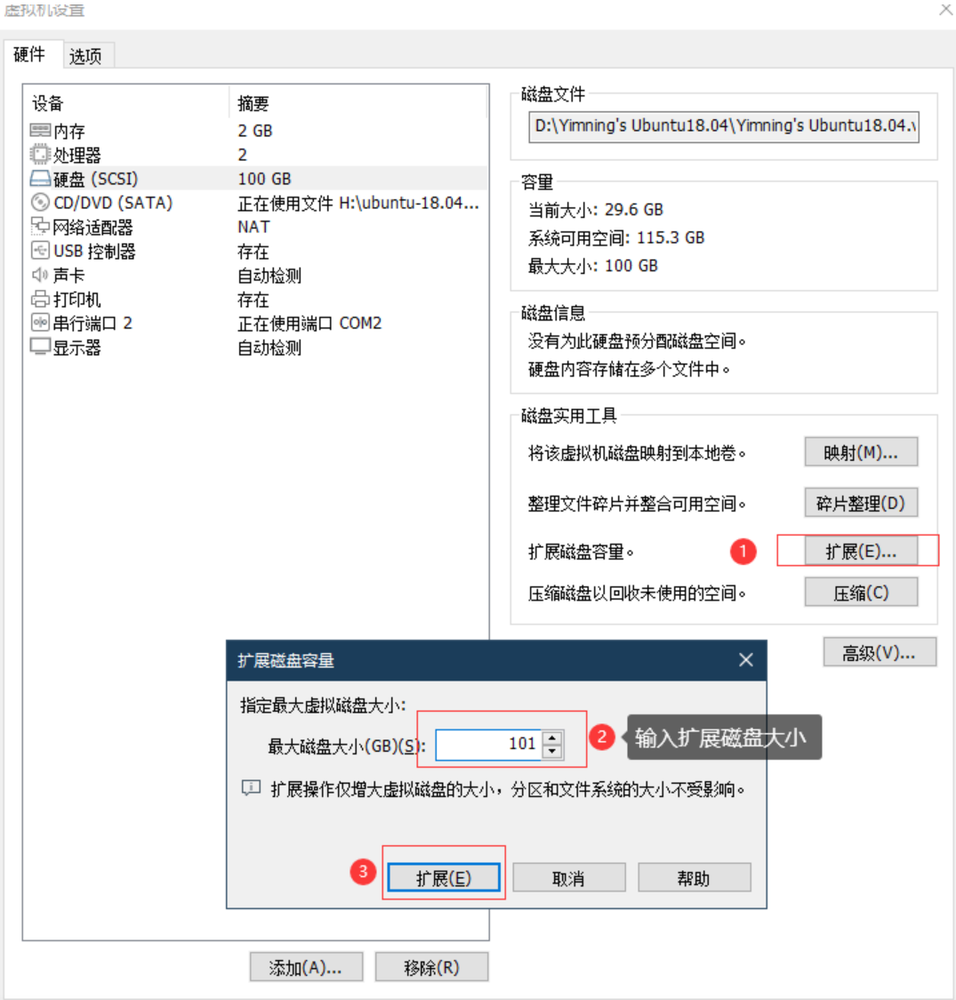
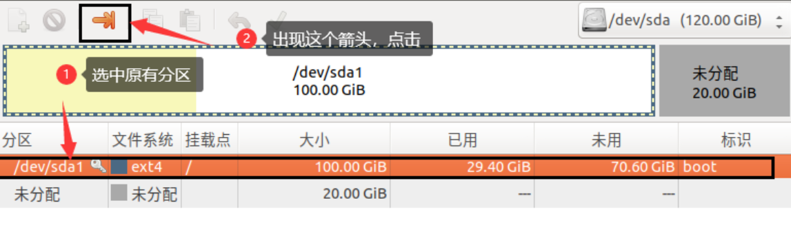
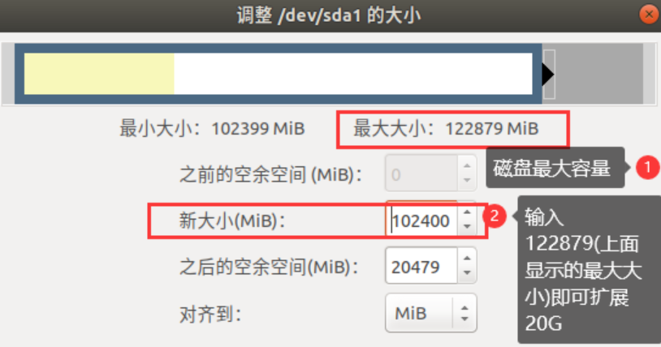
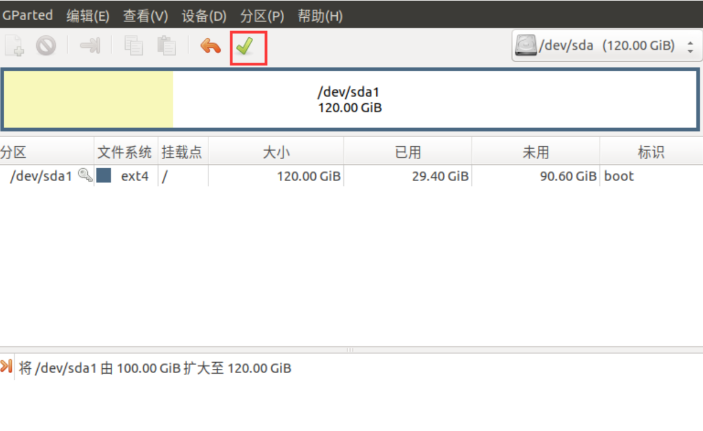
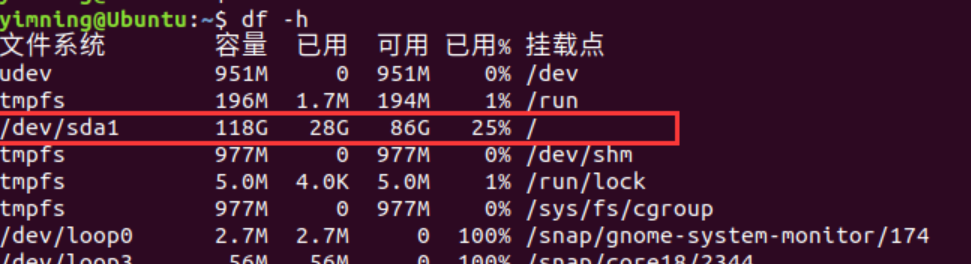

    新建虚拟机时会系统默认的磁盘空间为20G，如果系统硬盘(SCSI)预留内存比较小、使用系统后或者搭建一些环境之后老是提示系统内存空间不足，就这通常需要扩展内存。

操作以下步骤：(环境Ubuntu 22.04)
1、关闭虚拟机，在虚拟机设置中硬盘——扩展——输入想要扩展磁盘的内存大小——点击扩展与确定。

2、然后重启虚拟机，打开终端

        输入命令sudo apt-get install gparted 下载gparted。
        终端输入sudo gparted启动工具。

启动之后操作步骤如下：

完成点击应用全部操作，去查看内存是否已扩展即可。

