## 一、C语言的简介

什么是C语言

C语言之父

C语言的由来

C语言的发展

为什么要学C语言/能做什么

为什么要学习这套C语言

本套课程适用人群

课程内容介绍

## 1、C语言标准

### 1.1 标准简史

1. 1972年C语⾔在⻉尔实验室诞⽣. 丹尼斯·⾥奇 参考B语⾔开发.
2. 1970-80年代，C语⾔被⼴泛应⽤，产⽣很多不同的C语⾔版本. 程序可移植性⽐较差.
3. 1983年，美国国家标准委员会(ANSI) 成⽴⼀个⼩组来制定C语⾔的标准. C语⾔⽀持哪些语法、⽀持哪些功能
    等等.
4. 1989年，通过了C语⾔的第⼀个标准. C89标准.
5. 1990年，国际标准化组织(ISO) 和 国际电⼯委员会(IEC) 将 C89标准当做国际的C语⾔标准. C90标准. C89和
    C90指的是同⼀个标准
6. 1994年 ISO和 IEC 对 C89标准进⾏修订. C94标准. 由于并没有增加新的语法特性，还是叫做 C89或者C90.
7. 1995年 ISO和IEC再次做了修正，C95 标准.
8. 1999年 ISO 和 IEC 发布了C语⾔新标准. C语⾔第⼆个标准. 在该标准中，新增许多实⽤的C语⾔语法特性. 增
    加新的关键字、可变⻓数组等等. C99标准
9. 2007年，重新修订了C语⾔.
10. 2011年， 发布新的版本。新增了⼀些语法，泛型、国际化⽀持. ⽬前为⽌最新版本是 C11.

### 1.2 标准的影响
1. 可将C语⾔的标准理解为C语⾔说明书。但其并没有强制性约束⼒。
> 如：微软拿到标准，认为有些标准不合理，不⽀持。 
>
> 微软认为某些特性⾮常好，但标准中没有，微软可以修改标准，新增语法.

2. 如果编译器不⽀持标准，我们即使使⽤标准中的语法仍然会报错。

3. 编译器版本也会影响程序。因此，编写程序之前要确定编译器版本。

### 1.3 常见的C/C++编译器:

1. Borland C++ 宝蓝公司

2. Intel C++ 英特尔编译器

3. VC++ 微软公司

4. g++编译器（gcc是编译套件）, Linux 默认使⽤的编译器. 对标准⽀持最好.

###1.4 C语⾔的优缺点
####   1.4.1 优点：

* 学习成本低。
* 运⾏速度快。
* 功能强⼤。

####  1.4.2  缺点：

* 代码实现周期⻓
* 可移植性差
* 对经验要求⾼
* 对平台库依赖多

## 1.5 C语言的应用领域

* 服务器。
* 操作系统。
* 上层应⽤。 MFC、QT

* 嵌⼊式。

* ⼈⼯智能、硬件驱动。

* 中间件。

* ⽹络攻防、数据安全。

* ⼤学必修课。

* 名企、外企。

## 2、常见开发工具

* Windows操作系统

  vs（visual studio）2013、2015、2017、2019、2022

  Clion：跨平台IDE、跟Java的IDEA、python的pycharm是同一家公司的

  Qt Creator 跨平台IDE

* MacOS（苹果电脑的操作系统）

  Xcode
  Clion：跨平台IDE。
  Qt Creator 跨平台IDE。

* Linux：

  vi/vim —— ⽂本编辑器。
  Clion：跨平台IDE。
  Qt Creator 跨平台IDE。

>备注：大多企业开发用vs会更多一些

## 3、第一个程序

### 3.1 环境搭建：

1. 打开微软的官方网站 https://visualstudio.microsoft.com/，下载 Visual Studio 安装包。

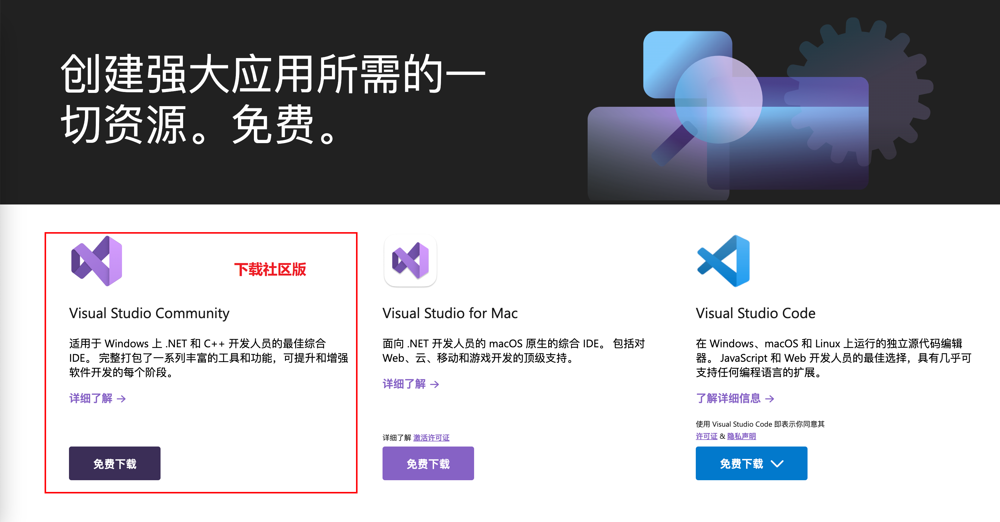

2. 双击安装包进行安装

   **操作一：**在 “工作负荷” 标签页中，选择 “使用 C++的桌面开发” 选项即可。

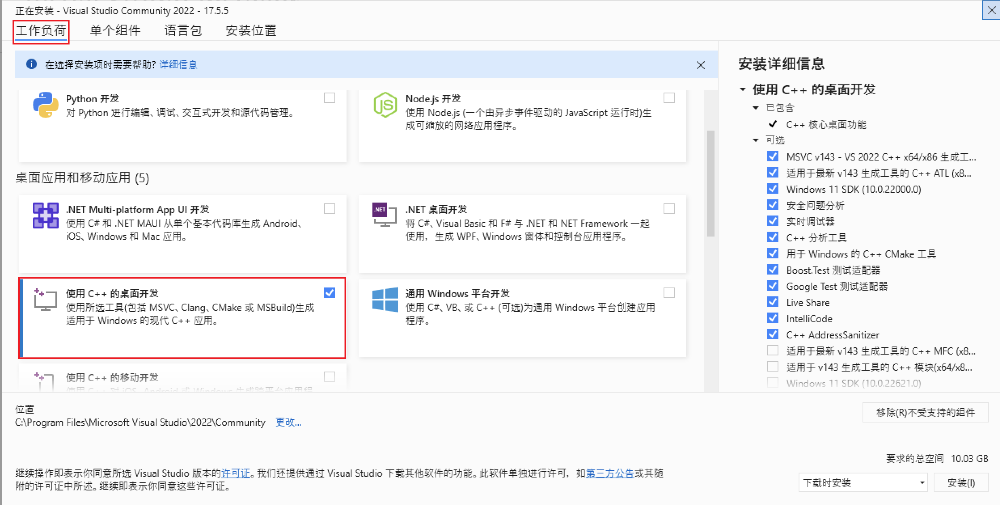

​	**操作二：**“安装位置” 中修改安装路径。

路径的要求：

​	1，不要有中文，不要有空格，不要有一些特殊符号

​	2，选择一个统一的文件夹进行管理

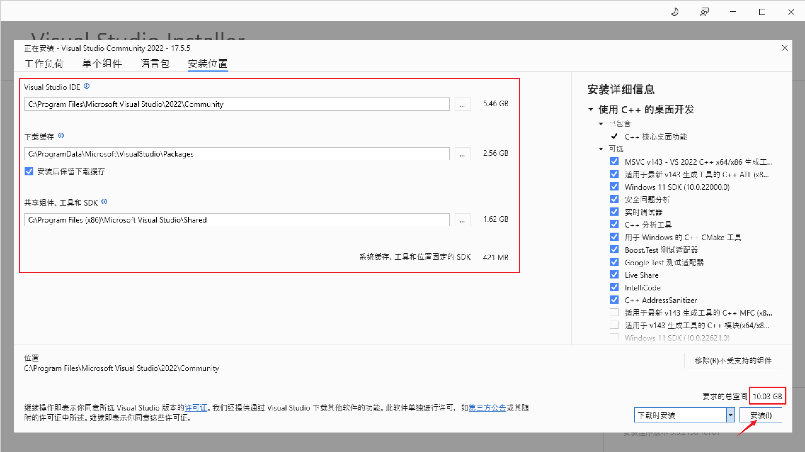

3. 自动下载并安装，过程略微漫长，耐心等待。

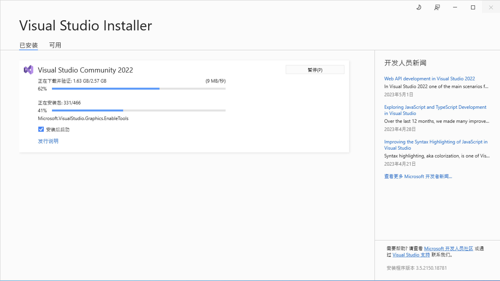

4. 安装完成，弹出 “安装完毕” 对话框。 点击确定。

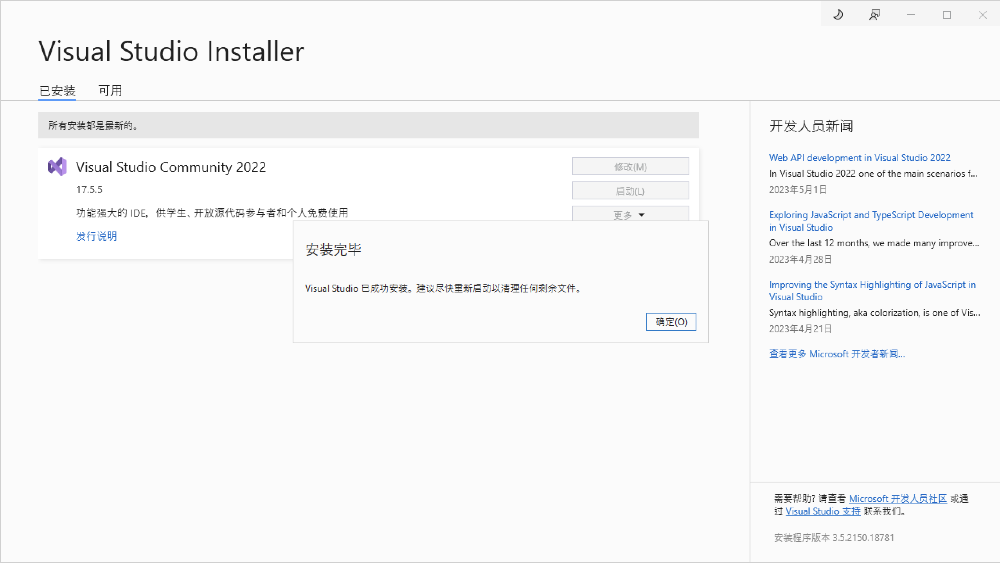

5. 接下来，VS希望你使用微软的账号登录，没有可以注册一个。也可以点击“暂时跳过此项”。

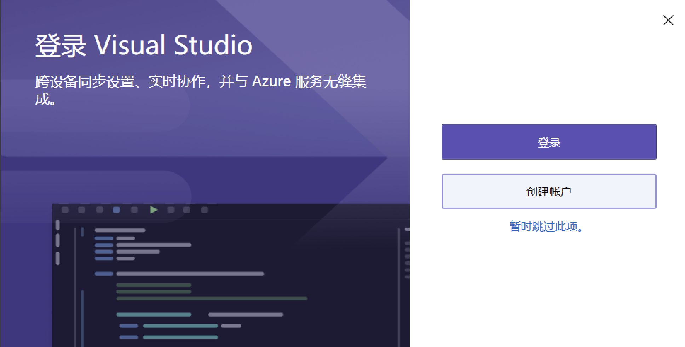

6. 根据提示选择一个自己喜欢的主题

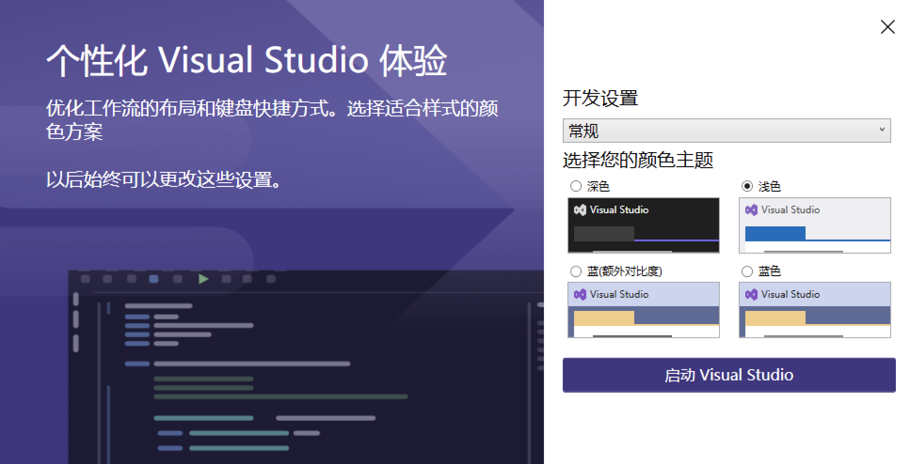

7. 点击启动，到此整个环境全部搭建完毕

### 3.2 第一个代码HelloWorld

1. 创建项目

   点击 “创建新项目”，创建一个项目。

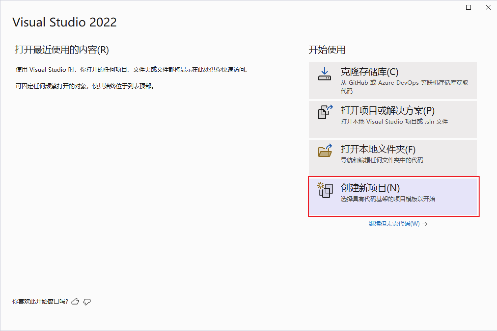

2. 选择创建 “控制台应用”，点击下一步。

 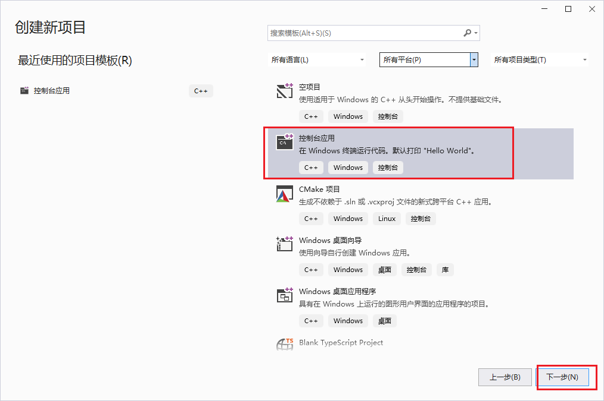

3. 指定项目名称。确保位置下的项目存储目录存在。 勾选 “将解决方案和项目.....” ，点击 “创建”。

 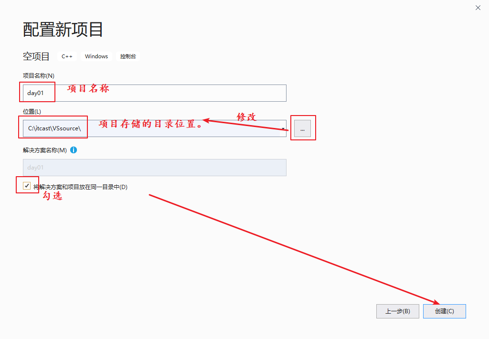

4. 右侧的解决方案管理器可以按照自己的习惯是放在左侧或者右侧

   默认是右侧，可以拖到左侧来，每个人的习惯不同，没有固定标准

 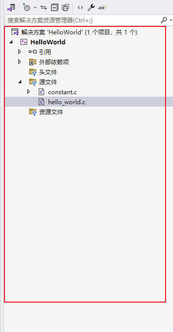

5. 创建 helloworld.c ⽂件

   右键选择原文件，选择添加，选择新建项

 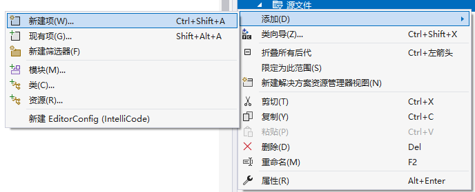

6. 在弹出的编辑框中，选中 “C++文件(.cpp)”，将 下方 “源.cpp” 手动改为要新创建的文件名，

   如：helloWorld.c 。注意，默认 cpp 后缀名，要手动改为 .c 后缀名，然后点击 “添加”。

 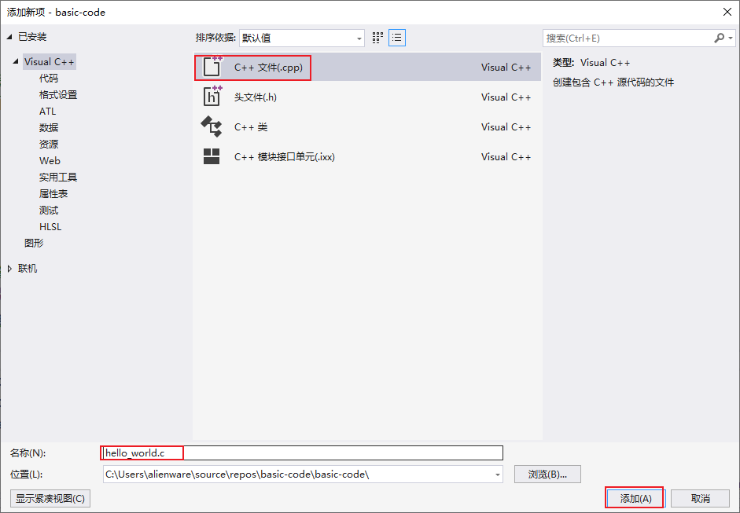

7. 编写 helloworld.c程序。

```c
#include <stdio.h>
int main(void)
{
    printf("hello world!\n");
    return 0;
}
```

8. 点击上方绿色空心三角运行即可

 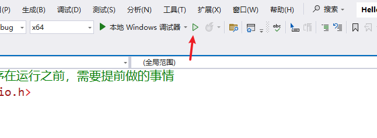

### 3.2 代码逐行分析

1. ‘#include' ： 引⼊头⽂件专⽤关键字。

2. <> : ⽤来包裹 库头⽂件名

3. stdio.h : 使⽤的头⽂件。因为程序中使⽤了 printf() 函数。就必须使⽤该头⽂件。

  >std：标准：standard
  >i： input 输⼊。
  >o： output 输出。

4. int ：main 函数返回值为整型。

5. main： 整个程序的⼊⼝函数。 任何.c 程序，有且只有⼀个 main 函数。

6. printf(); C语⾔向屏幕输出字符使⽤的函数。

7. printf(“helloworld\n”) 

   > printf（）；向屏幕输出一段内容
   >
   > helloworld： 待写出的字符串内容。
   >
   > \n: 回⻋换⾏。

8. return 0；

   > return 返回。 C程序要求，main 函数要有返回值。借助 return 实现返回。
   >
   > 0：成功！因为 int ，返回整数。

**注意事项**

* 程序中使⽤的所有的字符，全部是 “英⽂半⻆” 字符。
* 程序中，严格区分⼤⼩写。
* “;” 代表⼀⾏结束。不能使⽤ 中⽂ “；”，必须是英⽂。

### 3.3 代码执行流程分析

完成的C语言运行，分为以下4步，在VS中我们直接运行，其实是把中间的步骤给省略了

* 预处理（这一步后面单独讲解）

  简单理解，就是先找到#include后面的 <stdio.h>这个文件

* 编译

  把c文件编译成二进制文件后缀名为obj

* 连接/链接

  把预处理找到的h文件，还有编译之后产生的obj文件打包在一起，产生exe文件

* 运行

  运行exe文件

 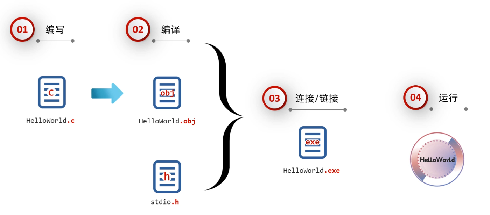


